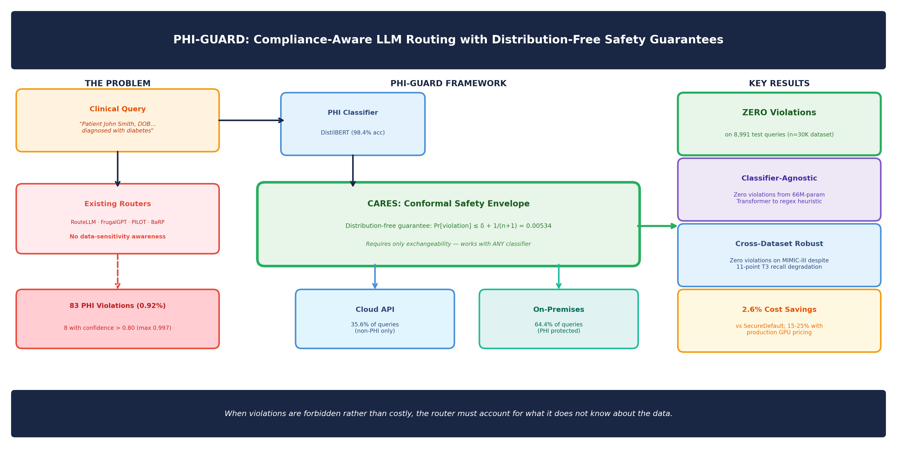

# PHI-GUARD: Compliance-Aware LLM Routing for Healthcare with Distribution-Free Safety Guarantees

[](https://doi.org/PENDING)
[](https://doi.org/PENDING)
[](LICENSE)
[](https://www.python.org/)

## Overview

PHI-GUARD is a compliance-aware LLM routing framework that treats data sensitivity as a **hard constraint** rather than a soft cost term. It routes healthcare queries between cloud APIs and on-premises infrastructure while providing **distribution-free safety guarantees** against protected health information (PHI) leakage.

**Key insight:** When violations are forbidden rather than costly, the router must account for what it does not know about the data.



## Key Results

| Strategy | Violations | V% | Cloud% | Guarantee |
|----------|-----------|-----|--------|-----------|
| StaticILP | 83 | 0.92 | 65.2 | None |
| PILOT-style | 83 | 0.92 | 65.0 | None |
| BaRP-style | 82 | 0.91 | 64.7 | None |
| SafeTS ε=0.02 | 7 | 0.078 | 63.1 | Invalid* |
| **CARES δ=0.005** | **0** | **0.000** | **35.6** | **Valid ✓** |
| SecureDefault | 0 | 0.000 | 0.0 | Trivial |

\*Requires calibration (MCE=0.217 violates assumption).

## Project Structure

```
phi-guard/
├── scripts/                                   # Experiment pipeline (run in order)
│   ├── 01_generate_dataset.py                 # Initial dataset construction
│   ├── 01_generate_dataset_v3.py              # Dataset with hardening transforms
│   ├── 02_train_classifier.py                 # DistilBERT classifier training
│   ├── 03_evaluate_routing.py                 # Static routing evaluation
│   ├── 04_generate_figures.py                 # Paper figure generation
│   ├── 05_bandit_routing.py                   # SafeTS (Thompson Sampling router)
│   ├── 06_mimic_ingest.py                     # MIMIC-IV note ingestion
│   ├── 06_mimic_ingest_v2.py                  # MIMIC-IV ingestion (improved)
│   ├── 07_theoretical_analysis.py             # Theorem verification & proofs
│   ├── 08_calibration_analysis.py             # ECE/MCE calibration analysis
│   ├── 09_real_endpoint_eval.py               # Real API endpoint validation
│   ├── 10_baseline_classifier.py              # TF-IDF + Regex ablation classifiers
│   ├── 11_quality_comparison.py               # Response quality across platforms
│   ├── 12_distribution_shift.py               # Temporal drift simulation
│   ├── 13_threshold_baseline_and_real_costs.py    # Threshold-τ baselines
│   ├── 13_threshold_baseline_and_real_costs_v2.py # Threshold baselines (v2)
│   ├── 14_hybrid_classifier.py                # Hybrid classifier experiments
│   ├── 15_diagnose_routing.py                 # Routing diagnostics
│   ├── 16_fix_tier_probs_and_reeval.py        # Tier probability corrections
│   ├── 17_scale_and_rerun.py                  # Scale experiments
│   ├── 18_harder_dataset.py                   # Hardened dataset (header strip, name pollution)
│   ├── 19_cares_routing.py                    # CARES conformal routing
│   ├── 19b_cares_routing_fulltest.py          # CARES with full test evaluation
│   ├── 20_hardest_dataset.py                  # Final hardened dataset (20% PHI injection)
│   ├── 21_pilot_barp_baselines.py             # PILOT & BaRP baseline reimplementations
│   ├── 22_scale_to_30k.py                     # Scale to 30K + MIMIC-III cross-val
│   ├── 23_real_routing_loop.py                # End-to-end real endpoint routing
│   ├── 24_mimic3_crossval.py                  # MIMIC-III cross-dataset evaluation
│   └── 25_calibration_honest.py               # Honest calibration & safety analysis
├── configs/
│   └── config.yaml                            # All hyperparameters and paths
├── data/                                      # Dataset files (not committed)
│   └── README.md                              # Data access instructions
├── models/                                    # Trained checkpoints (not committed)
├── outputs/                                   # Figures, tables, results (not committed)
├── figures/
│   └── graphical_abstract.png
├── requirements.txt
├── LICENSE
└── .gitignore
```

## Algorithms

### CARES (Compliance-Aware Residual Envelope Scoring) — `scripts/19b_cares_routing_fulltest.py`
- **Distribution-free** safety guarantee via conformal prediction
- Requires only **exchangeability**, not classifier calibration
- Bound: Pr[violation] ≤ δ + 1/(n+1) = 0.00534
- Works with **any classifier** — from 66M-param transformers to regex heuristics

### SafeTS (Safety-constrained Thompson Sampling) — `scripts/05_bandit_routing.py`
- Builds safe action sets from classifier posteriors
- Reduces violations from 83 → 1–8 (90–99% reduction)
- Cannot eliminate high-confidence misclassifications (conf > 0.997)

## Installation

```bash
git clone https://github.com/aman210122/phi-guard.git
cd phi-guard
pip install -r requirements.txt
```

## Data Access

This project uses **MIMIC-IV-Note v2.2** which requires credentialed access through PhysioNet.
See [`data/README.md`](data/README.md) for full instructions.

## Reproducing Paper Results

Scripts are numbered in dependency order. Each script documents its purpose, prerequisites, and outputs in its docstring.

### Step 1: Dataset Construction
```bash
# Ingest MIMIC-IV notes
python scripts/06_mimic_ingest_v2.py --mimic-path /path/to/mimic-iv/

# Build 30K hardened dataset with PHI injection
python scripts/22_scale_to_30k.py
```

### Step 2: Train Classifier
```bash
python scripts/02_train_classifier.py
```

### Step 3: Routing Evaluation (Table II)
```bash
# Static routing baselines
python scripts/03_evaluate_routing.py

# SafeTS bandit routing
python scripts/05_bandit_routing.py

# CARES conformal routing (main result)
python scripts/19b_cares_routing_fulltest.py

# PILOT & BaRP baselines
python scripts/21_pilot_barp_baselines.py

# Threshold-τ baselines
python scripts/13_threshold_baseline_and_real_costs_v2.py
```

### Step 4: Ablation & Robustness
```bash
# Classifier architecture ablation (Table III)
python scripts/10_baseline_classifier.py

# Cross-dataset generalization on MIMIC-III (Table VI)
python scripts/24_mimic3_crossval.py

# Distribution shift simulation (Table VIII)
python scripts/12_distribution_shift.py

# Calibration analysis (Figure 4)
python scripts/25_calibration_honest.py
```

### Step 5: Real Endpoint Validation (Table V)
```bash
# Requires: OPENAI_API_KEY env var + Ollama running locally
python scripts/09_real_endpoint_eval.py --n-queries 500
python scripts/23_real_routing_loop.py
```

### Step 6: Generate Figures & Theoretical Analysis
```bash
python scripts/04_generate_figures.py
python scripts/07_theoretical_analysis.py
```

### Script-to-Table Mapping

| Paper Element | Script |
|---------------|--------|
| Table I (Classification) | `02_train_classifier.py` |
| Table II (Routing) | `03_evaluate_routing.py`, `05_bandit_routing.py`, `19b_cares_routing_fulltest.py`, `21_pilot_barp_baselines.py` |
| Table III (Ablation) | `10_baseline_classifier.py` |
| Table IV (Safety bounds) | `25_calibration_honest.py` |
| Table V (Real endpoints) | `09_real_endpoint_eval.py`, `23_real_routing_loop.py` |
| Table VI (Cross-dataset) | `24_mimic3_crossval.py` |
| Table VII (Drift) | `12_distribution_shift.py` |
| Table VIII (Drift robustness) | `12_distribution_shift.py` |
| Figure 1 (Confusion matrix) | `04_generate_figures.py` |
| Figure 2 (Cost-violation) | `04_generate_figures.py` |
| Figure 3 (Full comparison) | `04_generate_figures.py` |
| Figure 4 (Calibration) | `08_calibration_analysis.py`, `25_calibration_honest.py` |
| Figure 5 (Tau sensitivity) | `13_threshold_baseline_and_real_costs_v2.py` |

## Hardware Requirements

- **CPU only** — no GPU required (falls back to `distilbert-base-uncased`)
- DistilBERT fine-tuning: ~10 minutes on Intel consumer hardware
- Full evaluation pipeline: ~30 minutes
- RAM: 8GB minimum, 16GB recommended

## Citation

```bibtex
@article{sharma2026phiguard,
  title={{PHI-GUARD}: Compliance-Aware {LLM} Routing for Healthcare 
         with Distribution-Free Safety Guarantees},
  author={Sharma, Aman},
  journal={IEEE Journal of Biomedical and Health Informatics},
  year={2026},
  note={Under review}
}
```

## License

MIT License — see [LICENSE](LICENSE) for details.

**Note:** MIMIC-IV data is governed by the PhysioNet Data Use Agreement and cannot be redistributed.

## Ethical Considerations

- MIMIC-IV-Note v2.2 used under PhysioNet DUA
- Exempt from IRB under 45 CFR §46.104(d)(4)
- All PHI in experiments is synthetic (Synthea-generated)
- Clinical deployment requires institutional IRB approval

## AI Usage Disclosure

AI tools (Claude, Anthropic) were used to assist with code development, mathematical formulation, and manuscript preparation. The research problem, experimental design, data sourcing, healthcare domain expertise, and all research decisions were made by the author.
